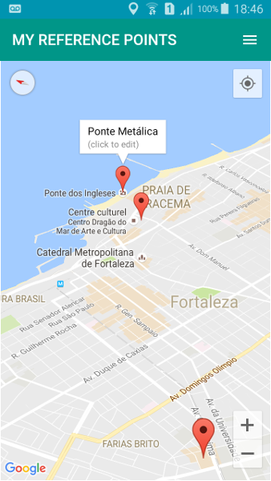
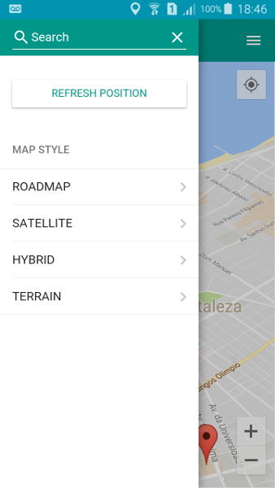
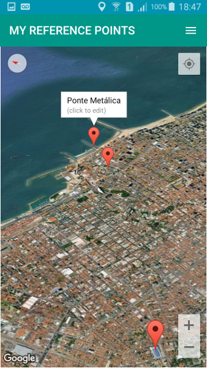
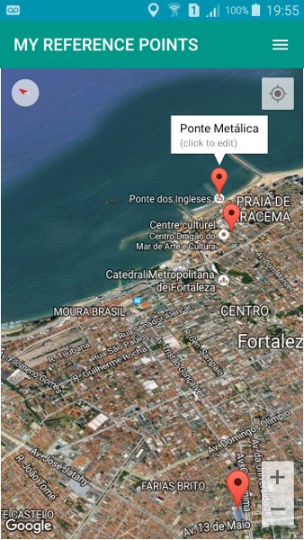

# About
This is an android application made by the using of Cordova platform. The main functionality of this software is to keep the user locations and displays them on the maps.

For the layout building it was necessary the use of the Google Maps plugins and [Framework 7](https://framework7.io).

# Installation

### 1) Install Cordova and Android Platform
- npm install -g cordova
- cordova platform add android

### 2) Install Plugins of Sqlite and Google Maps
- cordova plugin add cordova-sqlite-storage ([more](https://github.com/litehelpers/Cordova-sqlite-storage))
- cordova plugin add cordova-plugin-googlemaps --variable API_KEY_FOR_ANDROID="YOUR_ANDROID_API_KEY_IS_HERE" ([more](https://github.com/mapsplugin/cordova-plugin-googlemaps))

# Screenshots

